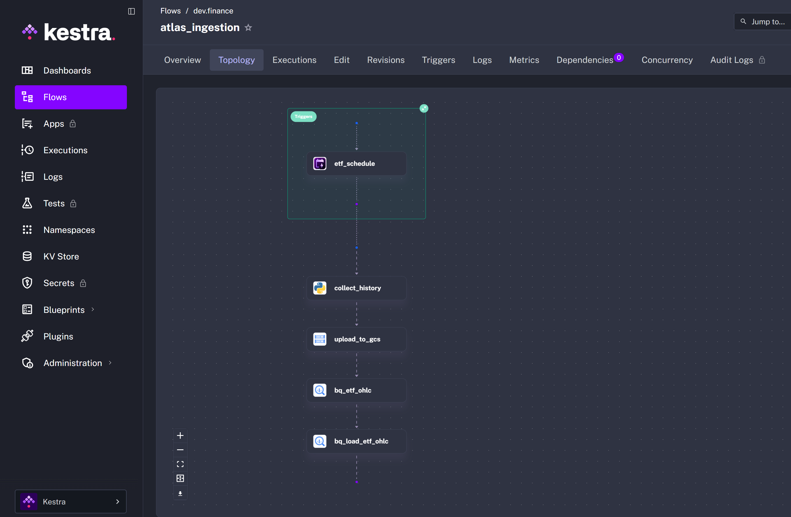
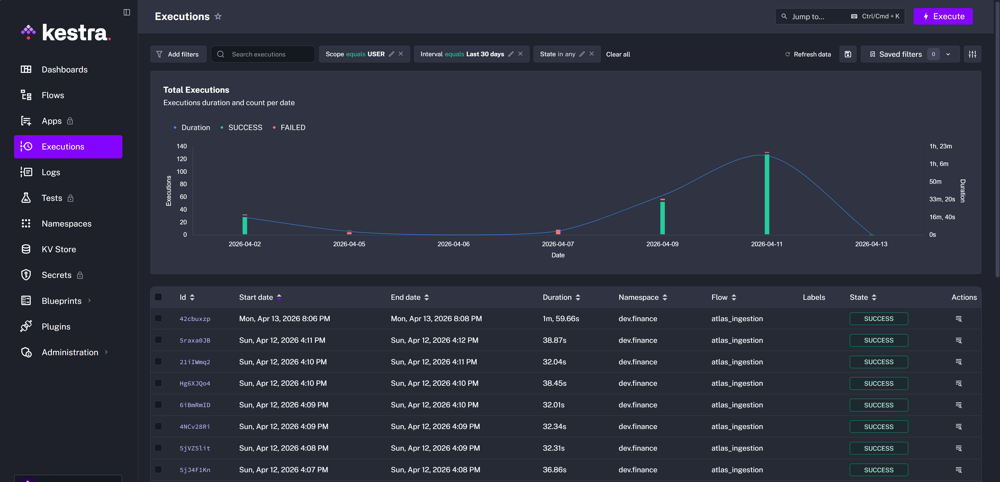
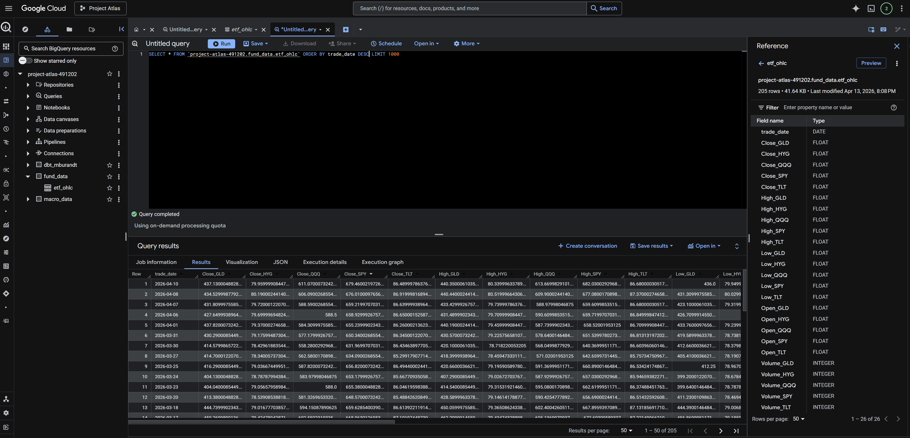
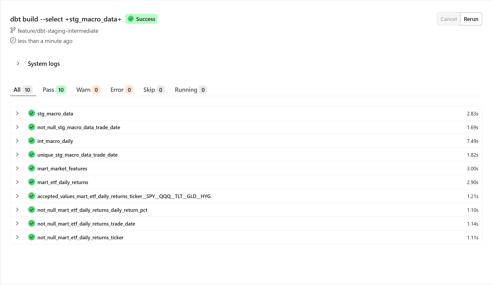

# Project Atlas

A personal data engineering portfolio project for ingesting, transforming, and analyzing financial market data — ETF prices and macroeconomic indicators — with a long-term vision toward market regime classification.

---

## Problem Statement

Public macroeconomic and ETF data is freely available but scattered, inconsistently formatted, and rarely combined in a way that's useful for quantitative analysis. Project Atlas builds a fully automated pipeline that ingests raw financial data from multiple sources, transforms it into a clean analytical layer, and surfaces it through a dashboard — creating the foundation for future regime detection and feature modeling work.

---

## Architecture

```
FRED API          yfinance
    │                 │
    ▼                 ▼
[ Kestra Orchestration (Docker / GCP VM) ]
    │                 │
    ▼                 ▼
[ Google Cloud Storage (Raw Layer) ]
    │
    ▼
[ BigQuery - Raw Dataset ]
    │
    ▼
[ dbt Cloud - Staging + Mart Models ]
    │
    ▼
[ BigQuery - Analytical Layer ]
    │
    ▼
[ Looker Studio Dashboard ]
```

Raw data lands in GCS, gets loaded into BigQuery's raw layer, and is transformed by dbt into clean staging and mart models. Looker Studio connects directly to BigQuery for visualization.

---

## Tech Stack

| Layer | Tool |
|---|---|
| Orchestration | Kestra |
| Cloud Storage | Google Cloud Storage |
| Data Warehouse | BigQuery (`project-atlas-491202`, `us-central1`) |
| Transformation | dbt Cloud |
| Visualization | Looker Studio |
| ETF Data | yfinance (Python) |
| Macro Data | FRED API |
| Infrastructure | Docker Compose → GCP VM |

---

## Cloud & Infrastructure

Project Atlas runs entirely on Google Cloud Platform (GCP). All cloud resources 
are provisioned automatically via code — no manual console setup is required.

**Resource provisioning** is handled by the `atlas_gcp_setup` Kestra flow, which 
creates the GCS bucket and BigQuery datasets (`fund_data`, `macro_data`) on first 
run. Table schemas and partitioning are defined as DDL within the ingestion flows 
themselves, meaning the full data infrastructure is created automatically on the 
first pipeline execution.

**Services used:**
- Google Cloud Storage — raw data lake (CSV landing zone for ETF and macro data)
- BigQuery — data warehouse (raw ingestion target + analytical layer via dbt)
- GCP VM *(planned)* — always-on Kestra deployment for scheduled execution

All infrastructure definitions live in the Kestra flow YAMLs under `flows/` in 
this repository, version-controlled alongside the pipeline and transformation code.

---

## Pipeline Walkthrough

### Ingestion

Two Kestra flows run on schedule:

**`atlas_fund_ingestion`** runs daily. It pulls OHLC price data for five ETFs (SPY, QQQ, TLT, GLD, HYG) via yfinance, writes a CSV to GCS under `raw/fund_data/`, creates the BigQuery target table if it doesn't exist, and loads the data with `WRITE_APPEND`.

**`atlas_macro_ingestion`** runs monthly on the 1st. It fetches seven macroeconomic series from the FRED API — yield curve spread (T10Y2Y), Fed Funds Rate, CPI, unemployment, high-yield credit spread, VIX, and 10-year inflation expectations — writes a CSV to GCS under `raw/macro/`, and loads into BigQuery similarly.

Both flows use Kestra's secret store for API credentials and KV pairs for project configuration.

Here is a screenshot of the Kestra topology for the ingestion of ETF daily returns from yfinance


Here is a screenshot of successul backfilling runs (those occurring 4/12/2026) and current runs (those on/after 4/13/2026)


Here is a screenshot of the data once Kestra has successfully loaded it into Big Query


### Transformation

dbt Cloud handles all transformation logic in two layers:

**Staging** — one model per source table. Renames columns to snake_case, casts types explicitly, and surfaces clean data from BigQuery raw tables.

- `stg_etf_ohlc` — selects and renames OHLC columns for all five tickers from `fund_data.etf_ohlc`
- `stg_macro_data` — selects and renames all macro series from `macro_data.macro_data`

**Mart** — analytical models that combine and enrich the staging data.

- `mart_etf_features` — wide table with daily returns, rolling volatility, and momentum for each ETF
- `mart_etf_daily_returns` — long-format table (one row per trade date + ticker) produced by unpivoting the wide ETF returns columns; used directly by the dashboard scatter plot

Here is a successful build of various dbt models and corresponding data quality tests


### Dashboard

Looker Studio connects directly to BigQuery and surfaces three visualizations:

1. **Multi-series macro line chart** — VIX, High Yield Spread, and 2Y/10Y yield curve spread over time. Date range filter enabled.
2. **ETF return scatter plot** — daily return per ticker, colored by year/quarter. Each point is one trading day; each ETF occupies a distinct band on the Y axis.
3. **Macro scorecard tiles** — latest value for each macro indicator.

---

## Dashboard

[> Project Atlas](https://datastudio.google.com/reporting/19612fad-8c03-4d0e-9f8f-088b0c393b70)

---

## Reproducing This Project

### Prerequisites

- Docker Desktop
- GCP project with BigQuery and GCS enabled
- GCP service account with BigQuery Admin + Storage Admin roles
- FRED API key (free at [fred.stlouisfed.org](https://fred.stlouisfed.org/docs/api/api_key.html))
- dbt Cloud account (free tier)

### Steps

1. Clone this repo
2. Add your GCP service account JSON to the repo root — it is `.gitignore`d
3. Copy `.env.example` to `.env` and fill in your project values
4. Start Kestra: `docker compose up -d`
5. In the Kestra UI, create a namespace `atlas` and set the following KV pairs:
   - `GCP_PROJECT_ID`, `GCP_BUCKET_NAME`, `GCP_LOCATION`, `GCP_FUND_DATASET`, `GCP_MACRO_DATASET`
6. Add your service account JSON as a Kestra secret: `GCP_SERVICE_ACCOUNT`
7. Add your FRED API key as a Kestra secret: `FRED_API_KEY`
8. Upload the flows from `flows/` to the Kestra UI
9. Trigger backfill flows manually to seed historical data
10. In dbt Cloud, connect to `project-atlas-491202` and point to this repo
11. Run `dbt build` to materialize all models
12. Connect Looker Studio to BigQuery and point to the mart models

---

## Repository Structure

```
project-atlas/
├── flows/                  # Kestra flow YAMLs (source of truth)
│   ├── atlas_gcp_setup.yml
│   ├── atlas_ingestion.yml
│   ├── atlas_macro_ingestions.yml
│   └── atlas_kv.yml
├── dbt/
│   ├── models/
│   │   ├── staging/
│   │   │   ├── sources.yml
│   │   │   ├── stg_etf_ohlc.sql
│   │   │   └── stg_macro_data.sql
│   │   └── mart/
│   │       ├── mart_market_features.sql
│   │       ├── int_fund_daily.sql
│   │       ├── int_macro_daily.sql
│   │       └── mart_etf_daily_returns.sql
│   └── dbt_project.yml
├── docker-compose.yml
├── .env.example
├── .gitignore
└── README.md
```

---

## Future Work

- Deploy Kestra to a GCP VM for always-on scheduled execution (currently requires local Docker)
- Add a market regime classification model on top of the mart feature table
- Build a FastAPI layer to expose the feature table as a queryable REST API
- Add a RAG-based explanation engine for surfacing narrative context behind regime signals
- Expand ETF coverage and macro series